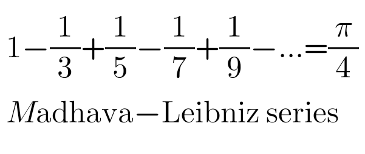
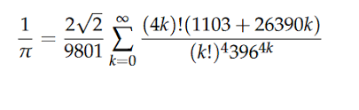

# _Advanced Multithreading_

##### This project had 2 parts:  
- **1st**: Calculating PI Number  
- **2nd**: Learning Semaphore

## Calculating PI Number
### 1st Way:
On the first approach for solving this problem and calculating PI Number with high accuracy,
I used a way which was a series to calculate PI / 4.

This series was bad, I tried to go with 100,000 terms, but it couldn't
calculate 7 digits correctly. So I moved to the next formula I found.

### 2nd Way: (Implemented one)
The 2nd way I got with was Ramanujan-Sato Series, This series result
gave 1 / PI and it was great, by calculating 200 terms and 1100 precision 
it calculated 1000 digits correctly, although it needed high cpu process
for calculating each term but by using multithreading it was not a big deal.

the implementation was pretty easy too. by using BigDecimal class and 
it's methods and also MathContext for setting the precision for calculations
the implementation was done.  
And also I used a fixedThreadPool (ExecutorService) for 
handling created threads and running them, and I set the number of threads to 4,
you can set it to higher or lower to see the difference between performance and 
the time it takes.

## Semaphore
Semaphore is like other solutions to race condition when using
multithreading and same resources, but it allows multiple permits 
to enter the area and the permits can be set on the constructor of this class.\
for example in this exercise we should've allowed only 2 threads 
access the same resource at the same time, so by putting "2" in 
the constructor we told the Semaphore we only have 2 permits so when
2 threads have acquired the permits, other threads which have requested should
wait until an acquired one release it. 
Using Semaphore was pretty easy and I think this is a 
positive point about it, because making things complicated 
is just bad and on the other hand simplicity is great.